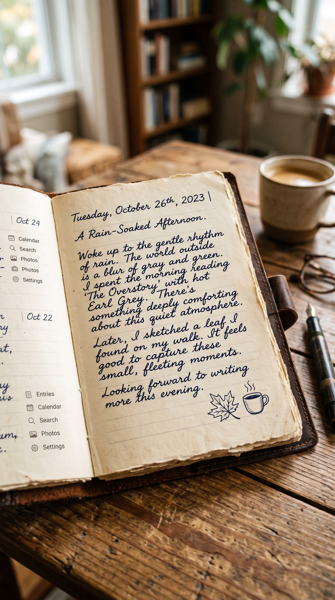

# Notes3D — Product & Technical Specification

**Status:** Draft v0.1 · **Date:** 2026-09-30

A journaling app that looks, moves, and feels like a real leather-bound paper journal: deckle-edged cream pages, ruled lines, flowing ink handwriting, and pages that curl and turn under your finger.



---

## 1. Vision and principles

**Vision:** Opening the app should feel like opening your own journal on a wooden desk on a rainy afternoon. The digital parts (search, calendar, photos, sync) are there, but they stay quiet and show up as things a real journal has: tabs, ribbons, margin notes, taped-in photos.

**Design principles**

1. **The book comes first.** Everything happens inside the book. No app-style full-screen modals over the pages unless they can't be avoided.
2. **Physical honesty.** Paper has thickness, grain, and imperfect edges. Ink has weight. Pages have a front and a back. Nothing snaps; everything eases.
3. **Imperfection by design.** Handwriting varies slightly glyph to glyph. Lines aren't perfectly straight. Edges are torn. It never looks like a computer font laid on a PNG.
4. **Calm UI.** Controls use muted ink and graphite tones, small sans-serif labels (like the margin index in the reference), and appear only when needed.
5. **Accessible underneath.** Under the realism sits a real, selectable, screen-reader-friendly text layer, and there is a reduced-motion mode.

---

## 2. Reference image breakdown

| Element in reference | App feature it maps to |
|---|---|
| Brown leather cover with strap/tab closure | Book cover, lock screen, and "close book" gesture |
| Cream, deckle-edged (torn) pages | Paper material system (§4.2) |
| Faint blue-grey ruled lines | Page templates (§4.3) |
| Navy cursive ink entry | Handwriting renderer (§5) |
| Date heading "Tuesday, October 26th, 2023" plus a title line | Entry header format (§7.2) |
| Earlier dated entries on the left page ("Oct 24", "Oct 22") | Entries flow chronologically across spreads (§7.1) |
| Small icon index: Entries, Calendar, Search, Photos, Settings | Margin index navigation (§8.1) |
| Ink doodles (maple leaf, steaming cup) | Ink stickers / doodles (§6.3) |
| Visible page stack thickness at the fore-edge | Dynamic page-block depth (§4.4) |
| Wooden desk, coffee cup, glasses, fountain pen, soft window light | Desk scene and ambient lighting (§4.5) |
| Blinking caret after the date | Live writing caret styled as an ink nib (§5.4) |

---

## 3. Platforms and tech stack

| Area | Choice | Rationale |
|---|---|---|
| Primary target | Tablets (iPad, Android) and desktop web | A book spread needs landscape space; stylus support matters |
| Phone | Single-page mode (one page visible, flips like a pocket notebook) | Two-page spreads don't fit portrait phones |
| App shell | React + TypeScript, packaged as a PWA; Capacitor for iOS/Android store builds | One codebase; offline-capable |
| Page rendering (as built) | DOM pages with a fold-geometry page turn: clip-path + reflection matrix + SVG shadows (§6.1) | Real, editable, accessible text on every page; smooth on phones without WebGL |
| 3D view (as built) | CSS 3D camera; pages as hinged strips that rise from the spine; turning pages lift and bend as strip chains | Realistic perspective with real, editable text; no WebGL needed |
| Reduced motion | Short cross-fade instead of a turn | Accessibility |
| Text layout | Custom paginator over a hidden DOM text layer (§7.3) | Exact line-to-ruled-line placement |
| Ink input | Pointer Events API (pressure, tilt, `pointerType: pen`) | Stylus handwriting |
| Local storage | IndexedDB (via Dexie) | Offline-first |
| Sync (phase 2) | End-to-end encrypted sync (CRDT, e.g. Yjs) to a simple backend | Journals are private |
| Audio | Web Audio API, short sampled paper sounds | Low latency |
| Haptics | Capacitor Haptics / `navigator.vibrate` | Tactile flip feedback |

---

## 4. Visual design: the physical book

### 4.1 Book anatomy

- **Cover:** Distressed brown leather, normal-mapped grain, stitched border, rounded corners, and a side **leather tab closure**. Name/monogram can be debossed on the front.
- **Endpapers:** Marbled or plain kraft paper inside the front and back covers.
- **Page block:** Cream pages bound at the spine, with a visible stack on the fore-edge that is thicker on whichever side has more pages.
- **Spine gutter:** Soft shadow and slight page bulge where the pages dive into the binding. Text never enters the gutter margin.
- **Ribbon bookmark (phase 2):** A satin ribbon hanging from the top of the spine, draggable to mark a page.

### 4.2 Paper material

| Property | Spec |
|---|---|
| Base colour | Warm cream `#F2E8D5`, varied ±3% per page with low-frequency noise |
| Aged tint | Slightly darker, yellower edges (`#E6D6B8`) via a vignette mask, 6–10% of page width |
| Texture | Tileable 2K paper-fibre albedo plus a normal map (cotton rag, visible flecks); no repeating seams visible at 2× zoom |
| Deckle edge | Procedural torn edge on the fore-edge, top, and bottom (alpha mask from 1D noise, amplitude 1–3 mm equivalent, with fibre fringe). Every page gets a unique seed so edges don't line up perfectly in the stack. |
| Thickness | Rendered as roughly 0.1 mm per page. Stack edge shading uses a striped texture so individual leaves are visible. |
| Show-through | 4–6% opacity mirrored ink from the back of the page is visible, as with real paper |
| Lighting response | Rough diffuse (no specular) plus subtle subsurface-ish brightening when a page is lifted toward the light |
| Wear (optional setting) | Slight corner curl on the most-used pages, occasional faint coffee ring (off by default) |

### 4.3 Page templates

Chosen per journal, overridable per entry:

- **Ruled (default):** Lines `#AEB9C7` at 35% opacity, 0.5 px, spacing 1 line-height (default 32 px at 100% scale), top margin of 2 lines, no red margin line (matches reference).
- **Dotted grid**, **Squared grid**, **Blank**, **Lined with margin** (faint red vertical margin rule).
- Ruled lines are printed slightly imperfectly: ±0.3 px wobble and minor opacity variation.

### 4.4 Page stack depth

- Fore-edge thickness on each side = `pagesOnSide × paperThickness`, clamped to a visual maximum.
- As the user moves through the journal, the left stack grows and the right shrinks. This is a key sign of "where am I in the book".
- A new journal starts with a fixed page count (default 200 pages). The book "expands" (adds a signature of 16 pages) when writing nears the end, so it never runs out.

### 4.5 Desk scene and lighting

- **Surface:** Weathered wood tabletop (PBR textures), slightly out of focus at the edges (depth-of-field vignette).
- **Props (decorative, toggleable):** Ceramic coffee cup, reading glasses, fountain pen. The pen is also the button for entering stylus ink mode.
- **Lighting:** Warm key light from the upper left (the "window"), soft ambient fill, contact shadows under the book. Page curls cast dynamic soft shadows onto the page beneath.
- **Ambient themes:** *Rainy afternoon* (default, cool window light, optional rain audio), *Morning sun*, *Lamplight evening* (warm tungsten, darker surroundings), *Plain* (neutral background, no props, for focus/performance).
- **Camera:** Slight top-down perspective (about 15–25° tilt) in "desk view"; a flat, straight-on "writing view" when editing, for legibility. The transition between them is a 400 ms ease.

---

## 5. Handwriting and ink

### 5.1 Two ways to write

1. **Keyboard → handwriting (primary):** The user types and the text is rendered as realistic handwriting on the ruled lines.
2. **Stylus / finger ink (phase 1b):** Freehand strokes with pressure-sensitive ink, for sketches, signatures, and handwritten notes. Optional handwriting recognition converts strokes into searchable text but keeps the original ink visible.

### 5.2 Handwriting typefaces

- Ship 4–6 curated script/handwriting families, with licences confirmed (OFL preferred). Examples of the style to target: an upright, connected cursive like the reference (e.g. *Homemade Apple*, *Mrs Saint Delafield*-like), a neat print (*Caveat*, *Patrick Hand*), and a casual print (*Kalam*, *Nanum Pen*).
- Headings (date, title) may use a slightly larger, more formal script from the same family.
- The font must support **OpenType contextual alternates (`calt`) and multiple glyph variants per letter**, so repeated letters (e.g. "ll", "ee") don't look stamped. If a chosen font lacks alternates, the renderer does the variation itself (§5.3).
- **Personal handwriting font (phase 3):** The user writes a template sheet with the stylus and the app generates a personal font.

### 5.3 Realism rules for rendered handwriting

Rendered by a dedicated handwriting layer, not plain CSS text:

| Effect | Spec |
|---|---|
| Baseline | Text sits *on* the ruled line; per-word baseline jitter ±0.6 px; whole-line drift up to ±1.5 px across the line |
| Rotation | Per-word rotation ±0.6°; slight upward drift for long lines, like real writing |
| Size | Per-glyph scale variation ±3% |
| Spacing | Per-word spacing variation ±8% |
| Glyph variety | Rotate through available alternates; never repeat the same variant on consecutive identical letters |
| Ink colour | Default navy-black `#1B2440`; per-stroke value variation ±4% |
| Ink density | Slight darker pooling at stroke starts/ends (simulated via a stroke-direction-aware texture or an SDF font with an ink-density map) |
| Paper interaction | Ink multiplies with paper texture so fibres show through; a subtle 0.3 px feathering/bleed on edges |
| Determinism | All randomness is seeded by (entry id, character offset) so the same entry always looks the same and doesn't shimmer when re-rendered |

### 5.4 Writing experience

- The caret is a thin ink-coloured nib mark that blinks gently (as after the date in the reference).
- **Newly typed characters "write in":** each glyph reveals along its stroke direction over roughly 60–90 ms, so it looks like it's being written, not stamped. It can be turned off, and is always off in reduced-motion mode.
- Line wrap happens only at word boundaries; there is no hyphenation by default.
- When the text reaches the bottom line of a page, typing continues onto the next page. On the last page of a spread, the page turns automatically (§6.4).
- Formatting is deliberately minimal and handwritten-looking: **underline** (hand-drawn wavy underline), **strike-through** (scribble line), **highlight** (translucent marker swash), bullet lists (ink dots), checkboxes (hand-drawn boxes with ticks). No bold/italic font switching; emphasis comes from underline.

### 5.5 Freehand ink (stylus)

- Tools: **Fountain pen** (pressure → width 0.6–2.4 px, slight taper), **Pencil** (graphite grain texture, low opacity, pressure → darkness), **Marker/highlighter**, **Eraser** (stroke eraser and pixel eraser).
- Colours: Navy, Black, Sepia, Forest Green, Burgundy (ink-bottle palette), plus a custom picker.
- Stroke smoothing: 1€ filter or Catmull-Rom smoothing; latency target < 20 ms on stylus hardware (use predicted points when available).
- Palm rejection: when a pen is in use, touches are ignored for drawing and only used for page turning/scrolling.
- Strokes are stored as vector data (points, pressure, timestamps) so they stay crisp at any zoom.

---

## 6. Page flipping

The core interaction. It has to feel physical.

### 6.1 Page curl model

- Each page is a subdivided plane mesh (e.g. 40×30 segments), deformed in the vertex shader.
- Deformation: **conical/cylindrical curl** around a fold axis defined by the grab point and drag direction (the standard "page curl" model: cylinder radius shrinks as the fold approaches the spine). A page grabbed at the top corner curls diagonally; grabbed at the mid-edge it curls straight.
- The **back of the page** renders the next page's content (the page is double-sided), including ink show-through.
- **Shadows:** a dynamic soft shadow under the lifting page, a darker crease shadow along the fold, and a highlight along the curl's outer surface.
- **Stiffness:** paper is slightly stiff. The fold lags behind the finger by a small spring (critically damped, ~120 ms settle) so it doesn't feel glued to the pointer.

### 6.2 Gestures and inputs

| Input | Behaviour |
|---|---|
| Drag from a page corner or the fore-edge | Page follows the finger with live curl; release past 50% of the width **or** with flick velocity > 0.5 px/ms completes the turn, otherwise it falls back |
| Tap on the outer 8% of page edge | Animated single-page turn |
| Swipe (anywhere, not on text while editing) | Single turn in the swipe direction |
| Keyboard | `←`/`→` or `PageUp`/`PageDown` turn a page; `Home`/`End` go to the first/last entry |
| Trackpad | Two-finger horizontal scroll drives the curl continuously |
| Riffle (fast-forward) | Long-press on the fore-edge stack then drag along it: pages riffle past quickly with a date preview bubble, like thumbing through a book. Release to open at that page. |
| Pinch in (phase 2) | Close the book to the cover; pinch out opens it |

- Turning is always interruptible: grabbing a page mid-animation takes over from its current position.
- When the user is editing, page-turn gestures only start from the page edges, so text selection and stylus writing are never mistaken for flips.

### 6.3 Doodles and stickers

- An ink-sketch sticker library in the same style as the leaf and coffee cup in the reference (nature, weather, food, travel, moods). They're rendered as ink on paper (they multiply with paper texture) and can be placed, scaled, and rotated freely.
- A small **mood/weather doodle** can be auto-suggested next to the date from the entry's weather (optional, with location permission).

### 6.4 Timing, sound, haptics

| Parameter | Value |
|---|---|
| Auto page turn duration | 650 ms (ease-in-out, slight overshoot on settle) |
| Fall-back duration (cancelled turn) | 300 ms |
| Riffle speed | Up to 15 pages/sec with a simplified curl |
| Sound | Soft paper-lift + turn "whoosh" + settle; pitch/volume ±10% randomisation; riffle has its own sound. Muted by default when the device is silent; toggle in Settings. |
| Haptics | Light tick when the page passes the spine; a softer tick on settle |

### 6.5 Performance

- 60 fps during page turns on a 2021 iPad / mid-range Android tablet; 120 fps on ProMotion devices where possible.
- Only the visible spread, the page being turned, and ±1 spread on each side are rendered with full textures. Pages further away are shown only as stack geometry.
- Page content is rasterised into a texture (at device pixel ratio) once per edit and cached. Only the page being edited re-renders live.
- Automatic fallback to the 2D renderer when the frame rate stays below 40 fps for 2 seconds.

---

## 7. Content model and layout

### 7.1 How entries sit in the book

- Entries are laid out **chronologically in one continuous book**, just like a paper journal. A new entry starts on the next free ruled line after the previous entry, with a 1-line gap (setting: "Start each entry on a new page").
- Each spread shows whatever entries fall on those pages. The reference's left page shows the tails of Oct 22 and Oct 24 entries.
- **Multiple journals** (e.g. "Daily", "Travel 2026", "Dreams"): each one is its own book on a **bookshelf** screen, with its own cover colour/material and paper template.

### 7.2 Entry header

- Line 1: full date in the heading script, e.g. *Tuesday, October 26th, 2023* (format adjustable; locale aware).
- Line 2 (optional): title, e.g. *A Rain-Soaked Afternoon.*
- Optional margin metadata in small graphite handwriting: time, location, weather.

### 7.3 Pagination engine

- Input: an ordered list of entries (rich text blocks, ink blocks, images, stickers).
- Output: a list of pages, each with positioned lines/objects snapped to the page template's ruled lines.
- Text flows line by line to the ruled lines. Images and stickers are **anchored** to a text position (so they move with it) or **pinned** to a page position (so they stay put, like a pasted-in photo).
- Re-pagination is incremental. Editing an entry only re-flows from that entry forward, and it runs in a Web Worker.
- Page numbers are optional, small, in the bottom outer corner.

### 7.4 Photos

- Photos are placed as **physical prints**: white border (Polaroid or plain), a slight random rotation (±4°), and attached with washi tape, photo corners, or a paperclip (user choice). They cast a small shadow and have a subtle glossy sheen.
- Tapping a photo opens it full-size over the desk (the only modal-style view), with a caption in handwriting.

### 7.5 Data model (logical)

```ts
Journal  { id, title, coverStyle, paperTemplate, handwritingFont, inkColor, createdAt, pageCount }
Entry    { id, journalId, date, title?, createdAt, updatedAt, mood?, weather?, location?, tags[] }
Block    { id, entryId, order, type: 'text' | 'ink' | 'image' | 'sticker' | 'checklist', data }
  text:      { content: RichTextDoc }                         // underline, strike, highlight, lists
  ink:       { strokes: Stroke[], bbox, recognizedText? }
  image:     { assetId, frame: 'polaroid'|'plain', attach: 'tape'|'corners'|'clip', rotation, anchor }
  sticker:   { stickerId, x, y, scale, rotation, anchor }
Stroke   { tool, color, points: [x, y, pressure, t][] }
Asset    { id, blob, mime, width, height }
```

Layout (the pagination result) is *derived* data and is never the source of truth.

---

## 8. Navigation and features

### 8.1 Margin index (primary nav)

As in the reference: a small vertical list of icons and labels, printed in the outer margin of the left page in a clean grey sans-serif (e.g. Inter / SF Pro at 13 px, `#5B5F66`).

| Item | Behaviour |
|---|---|
| **Entries** | Table of contents: a handwritten index page listing entries by date and title; tap to jump (with a riffle animation to that page) |
| **Calendar** | A month grid, drawn as a hand-ruled calendar page. Days with entries have a small ink dot. Tap a day to jump there, or to start an entry on that date. |
| **Search** | Search field written on the page; results shown as a list of snippets with the match highlighted in marker. Full-text across text and recognised ink. |
| **Photos** | All photos as a scrapbook spread of taped-in prints; tap one to jump to its entry |
| **Settings** | See §8.3 |

The index fades to about 30% opacity while the user writes, and back to 100% on idle or on hover/tap.

Alternative layout (setting): **coloured edge tabs** sticking out of the fore-edge, one per section, like a planner.

### 8.2 Other features

- **New entry:** tap the fountain pen prop, press `⌘/Ctrl+N`, or tap the empty space after the last entry. The book flips (riffles) to the next free line and writes today's date.
- **Tags:** written as small handwritten `#tags` in the margin; searchable.
- **Prompts (optional):** a daily writing prompt appears as a faint pencil note on an empty page.
- **Export:** PDF that keeps the paper look (per journal or date range), plain Markdown, and a full JSON backup.
- **Print:** A5 print-ready layout.

### 8.3 Settings

Appearance (cover, paper colour, template, handwriting font, ink colour, desk theme, props on/off) · Writing (write-in animation, new page per entry, date format) · Motion & sound (page-turn sound, haptics, reduced motion, renderer: auto/3D/2D) · Privacy (app lock with Face ID / passcode, shown as the leather strap buckling) · Data (export, import, backup, sync) · Accessibility (§9).

---

## 9. Accessibility

- **Real text layer:** every page has an invisible, correctly ordered DOM text layer over it. Screen readers read entries as normal text, and it supports native selection, copy, spellcheck, and IME input.
- **Clean reading mode:** one toggle switches the handwriting to a high-legibility font (e.g. Atkinson Hyperlegible), removes baseline jitter, and increases contrast. The paper look stays.
- **Reduced motion** (follows the OS setting): page turns become a 150 ms cross-fade/slide, no write-in animation, no riffle.
- **Text size:** 80%–200%. Line spacing on the ruled template scales with it, so text always sits on the lines.
- Colour contrast of ink on paper ≥ 7:1 by default; UI labels ≥ 4.5:1.
- Everything reachable by keyboard, with visible focus rings styled as a pencil circle.

---

## 10. Privacy and data

- Local-first: everything works offline and is stored on the device.
- Optional app lock (biometric/passcode).
- Sync (phase 2) is end-to-end encrypted; the server never sees plaintext.
- No analytics on entry content. Only anonymous performance metrics (fps, crashes), and only with opt-in.

---

## 11. Non-functional requirements

| Area | Target |
|---|---|
| Cold start to open book | < 2.0 s on mid-range tablet |
| Page turn frame rate | 60 fps (p95 frame time < 16.7 ms) |
| Keystroke to rendered glyph | < 50 ms |
| Stylus latency | < 20 ms perceived |
| Journal size | Smooth with 2,000 pages / 1,000 photos |
| Offline | 100% of features except sync |
| Asset budget | Initial download < 8 MB (textures compressed as KTX2/Basis); extra desk themes lazy-loaded |
| Browsers | Latest 2 versions of Safari, Chrome, Edge, Firefox |

---

## 12. Acceptance criteria (MVP)

1. Opening the app shows the closed leather journal on the desk. Tapping it opens the cover with a 3D hinge animation, landing on the latest spread.
2. The pages show a cream paper texture, deckle edges, ruled lines, a gutter shadow, and fore-edge page stacks whose thickness reflects the position in the book.
3. Typing creates text in a cursive handwriting font that sits on the ruled lines, with visible per-glyph variation and no identical repeated letters side by side. Re-opening the entry shows exactly the same rendering.
4. Dragging a page corner curls the page in real time with a correct back-side and shadows. Releasing past halfway or with a flick completes the turn; otherwise it falls back.
5. Text overflowing a page continues onto the next page, and a page turn is triggered at the end of a spread.
6. The margin index opens Entries, Calendar, Search, Photos, and Settings, all rendered as pages of the book.
7. Photos can be added and appear as taped-in prints.
8. Everything works offline and persists across reloads.
9. Reduced-motion and clean-reading modes work, and a screen reader can read an entry.
10. Page turns stay at ≥ 55 fps on the reference mid-range tablet.

---

## 13. Milestones

| Phase | Scope |
|---|---|
| **0 · Prototype (2 wks)** | 3D book scene, paper material, page-curl shader with drag gestures, static placeholder content. Goal: prove the flip feels right. |
| **1 · MVP (6–8 wks)** | Handwriting renderer, typing and pagination, entries/date headers, margin index (Entries, Calendar, Search, Settings), photos, local storage, 2D fallback, accessibility basics |
| **1b · Ink** | Stylus pen/pencil/eraser, palm rejection, stickers/doodles |
| **2 · Polish & sync** | Desk themes and ambient audio, ribbon bookmark, riffle, multiple journals and bookshelf, E2E sync, PDF export, app lock |
| **3 · Personal** | Personal handwriting font generator, handwriting recognition, prompts, print layout |

---

## 14. Open questions

1. Is tablet-first right, or should phone single-page mode be the primary experience?
2. Keyboard-to-handwriting only for MVP, or is stylus ink needed from day one?
3. Font licensing: which handwriting families can be shipped commercially? Is a custom commissioned font in budget?
4. Should entries ever be editable "in place" after the day has passed, or should older entries lock (like ink that can't be erased), with only strike-through allowed? (Could be an optional "honest journal" mode.)
5. Sync backend: self-hosted, or a managed service?
6. Monetisation: are extra covers, papers, fonts, and desk themes premium add-ons?
